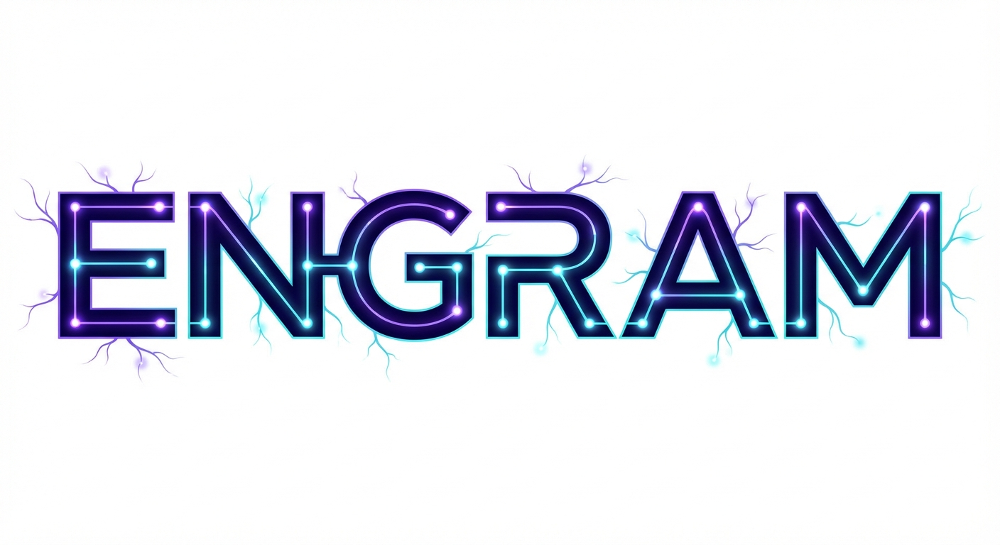

<p align="center">
  
</p>

<h3 align="center">Give your AI a memory that actually works.</h3>

<p align="center">
  <a href="https://github.com/199-biotechnologies/engram/stargazers">
    
  </a>
  &nbsp;
  <a href="https://x.com/longevityboris">
    
  </a>
</p>

<p align="center">
  <a href="https://www.npmjs.com/package/@199-bio/engram">
    
  </a>
  <a href="https://github.com/199-biotechnologies/engram/blob/main/LICENSE">
    
  </a>
  <a href="https://www.typescriptlang.org/">
    
  </a>
  <a href="https://modelcontextprotocol.io/">
    
  </a>
</p>

<p align="center">
Every conversation your AI has disappears the moment it ends. Names, preferences, context -- gone. Engram is an MCP server that gives your AI persistent personal memory with hybrid search (BM25 + semantic embeddings + knowledge graph), temporal decay modeled on the Ebbinghaus forgetting curve, and memory consolidation. Local-first. Works with Claude, Claude Code, and any MCP client.
</p>

<p align="center">
  <a href="#install">Install</a> &bull;
  <a href="#quick-start">Quick Start</a> &bull;
  <a href="#how-it-works">How It Works</a> &bull;
  <a href="#features">Features</a> &bull;
  <a href="#configuration">Configuration</a> &bull;
  <a href="#contributing">Contributing</a> &bull;
  <a href="#license">License</a>
</p>

---

## Why This Exists

You tell your AI something important. A name, an allergy, a deadline. Next conversation -- it's forgotten. You repeat yourself. You re-explain context. You carry the cognitive load that your AI should carry for you.

Engram gives your AI a real memory system. Tell it once:

> "My colleague Sarah is allergic to shellfish and prefers window seats. She's leading the Q1 product launch."

Weeks later, ask:

> "I'm booking a team lunch and flights for the offsite -- what should I know?"

Engram connects the dots. It remembers Sarah, the allergy, the seating preference, the workload. Your AI suggests restaurants without shellfish, books her a window seat, and flags that she's probably swamped with the launch.

This is not keyword matching. It is understanding.

> *An engram is a unit of cognitive information imprinted in a physical substance -- the biological basis of memory.*

---

## Install

```bash
npm install -g @199-bio/engram
```

Requires Node.js 18+.

---

## Quick Start

### With Claude Desktop (or any MCP desktop client)

Add to your MCP config (`~/Library/Application Support/Claude/claude_desktop_config.json`):

```json
{
  "mcpServers": {
    "engram": {
      "command": "npx",
      "args": ["-y", "@199-bio/engram"],
      "env": {
        "ANTHROPIC_API_KEY": "sk-ant-..."
      }
    }
  }
}
```

### With Claude Code

```bash
claude mcp add engram -- npx -y @199-bio/engram
```

That's it. Your AI now remembers.

---

## How It Works

Engram runs three search methods in parallel and fuses the results:

```
                        ┌─────────────────┐
                        │   Your Query    │
                        └────────┬────────┘
                                 │
                 ┌───────────────┼───────────────┐
                 │               │               │
                 ▼               ▼               ▼
          ┌──────────┐   ┌──────────┐   ┌──────────────┐
          │   BM25   │   │ Semantic │   │  Knowledge   │
          │ Keyword  │   │Embedding │   │    Graph     │
          │  Search  │   │  Search  │   │   Lookup     │
          └────┬─────┘   └────┬─────┘   └──────┬───────┘
               │              │                 │
               └──────────────┼─────────────────┘
                              │
                    ┌─────────▼─────────┐
                    │  Reciprocal Rank  │
                    │     Fusion        │
                    └─────────┬─────────┘
                              │
                    ┌─────────▼─────────┐
                    │  Temporal Decay   │
                    │  + Salience Score │
                    └─────────┬─────────┘
                              │
                    ┌─────────▼─────────┐
                    │  Ranked Results   │
                    └───────────────────┘
```

**BM25** finds exact keyword matches for names and phrases via SQLite FTS5.

**Semantic search** finds conceptually related content using MongoDB LEAF embeddings via Transformers.js (#1 on BEIR for small models, ~1ms/query, runs natively in Node.js).

**Knowledge graph** expands results through entity relationships -- ask about Sarah and her company, projects, and preferences all surface together.

Results are merged with Reciprocal Rank Fusion, then scored by temporal decay (Ebbinghaus forgetting curve) and salience. Fresh memories surface first. Important memories resist fading.

---

## Features

### Memory That Feels Real

**Things fade.** A memory from six months ago that you never revisited becomes harder to find. But important things -- a name, a birthday, a preference -- stay accessible even as time passes.

**Recall strengthens.** Every time a memory surfaces, it becomes more permanent. The things you think about often are the things your AI won't forget.

**Everything connects.** People link to places, places to events, events to details. The knowledge graph keeps your world coherent.

### MCP Tools

Your AI gets these capabilities through the Model Context Protocol:

| Tool | What It Does |
|------|-------------|
| `remember` | Store new information with importance and emotional weight |
| `recall` | Find relevant memories ranked by relevance and recency |
| `forget` | Remove a specific memory |
| `create_entity` | Add a person, place, or concept to the knowledge graph |
| `observe` | Record a fact about an entity |
| `relate` | Connect two entities (e.g., "works at", "married to") |
| `query_entity` | Get everything known about someone or something |
| `list_entities` | See all tracked entities |
| `stats` | View memory statistics |
| `consolidate` | Compress old memories and detect contradictions |
| `engram_web` | Launch a visual memory browser |

### Memory Consolidation

With an API key, Engram compresses old memories -- like sleep turning experiences into long-term storage:

1. Groups related low-importance memories
2. Creates AI-generated summaries (digests)
3. Flags contradictory information
4. Archives the originals

Storage stays lean, but nothing important gets lost.

### Privacy

Your memories stay on your machine. Everything lives in `~/.engram/`. The only external call is optional -- if you provide an API key, Engram can compress old memories into summaries. Core functionality works offline.

### Performance

On M1 MacBook Air:

| Operation | Time |
|-----------|------|
| Remember | ~100ms |
| Recall | ~50ms |
| Graph queries | ~5ms |
| Consolidate | ~2-5s per batch |

Storage: ~1KB per memory.

---

## Configuration

Environment variables:

| Variable | Purpose | Default |
|----------|---------|---------|
| `ENGRAM_DB_PATH` | Where to store data | `~/.engram/` |
| `ANTHROPIC_API_KEY` | Enable memory consolidation | None (optional) |
| `MAX_MEMORY_CACHE` | In-memory cache size | `1000` |
| `RETRIEVAL_TOP_K` | Initial retrieval pool size | `50` |
| `RERANK_TOP_K` | Final results after reranking | `10` |
| `ENGRAM_TRANSPORT` | Transport mode (`stdio` or `http`) | `stdio` |
| `PORT` | HTTP port for remote deployment | `3000` |

---

## Building from Source

```bash
git clone https://github.com/199-biotechnologies/engram.git
cd engram
npm install
npm run build
npm install -g .
```

Semantic search uses MongoDB LEAF (mdbr-leaf-ir) via Transformers.js — the #1 retrieval model on BEIR for models under 100M parameters. No Python or external dependencies required.

---

## Roadmap

- [x] Hybrid search (BM25 + semantic embeddings)
- [x] Knowledge graph with entity relationships
- [x] Memory decay and strengthening (Ebbinghaus curve)
- [x] Consolidation with contradiction detection
- [x] Web interface for visual memory browsing
- [ ] Export and import
- [ ] Scheduled consolidation

---

## Contributing

Contributions are welcome. See [CONTRIBUTING.md](CONTRIBUTING.md) for guidelines.

---

## License

[MIT](LICENSE) -- Copyright (c) 2025 Boris Djordjevic, 199 Biotechnologies

---

<p align="center">
  Built by <a href="https://github.com/longevityboris">Boris Djordjevic</a> at <a href="https://github.com/199-biotechnologies">199 Biotechnologies</a> | <a href="https://paperfoot.ai">Paperfoot AI</a>
</p>

<p align="center">
  <a href="https://github.com/199-biotechnologies/engram/stargazers">
    
  </a>
  &nbsp;
  <a href="https://x.com/longevityboris">
    
  </a>
</p>
