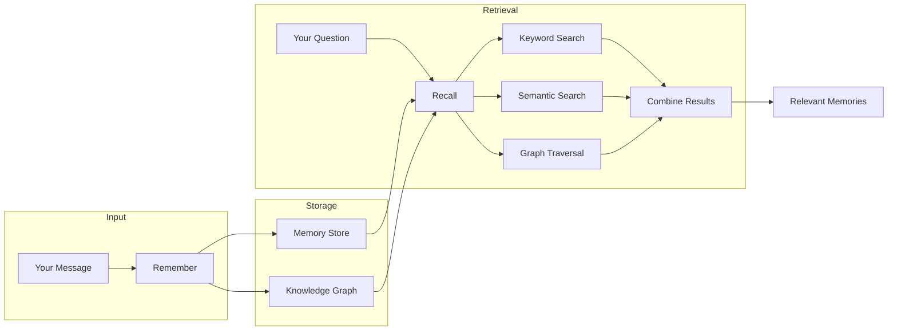
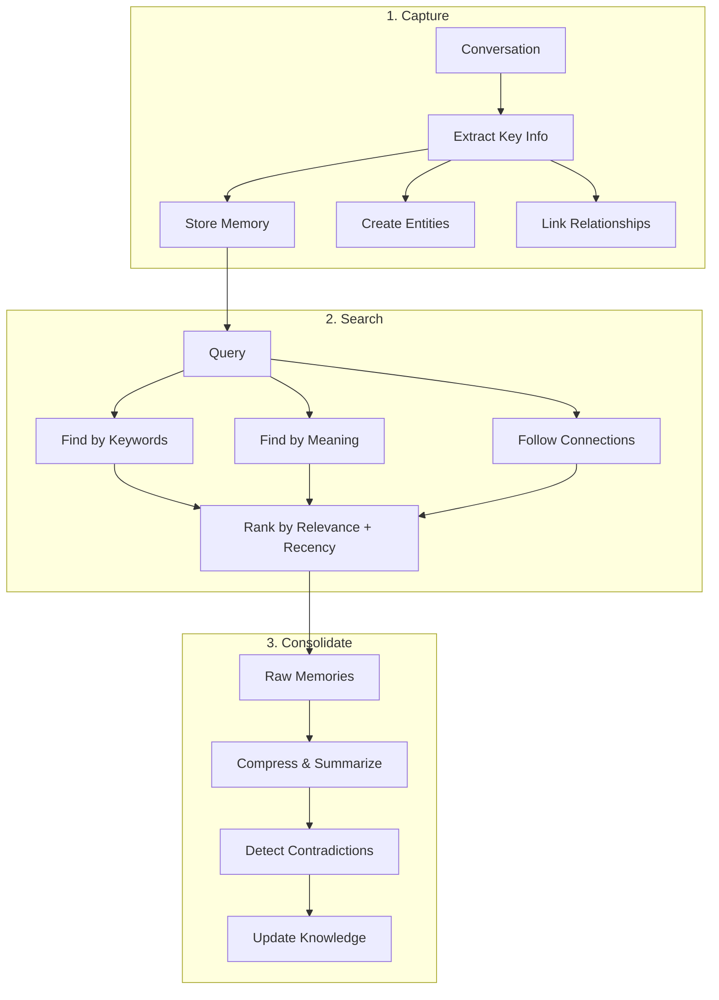
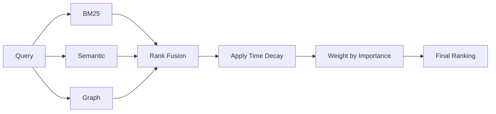
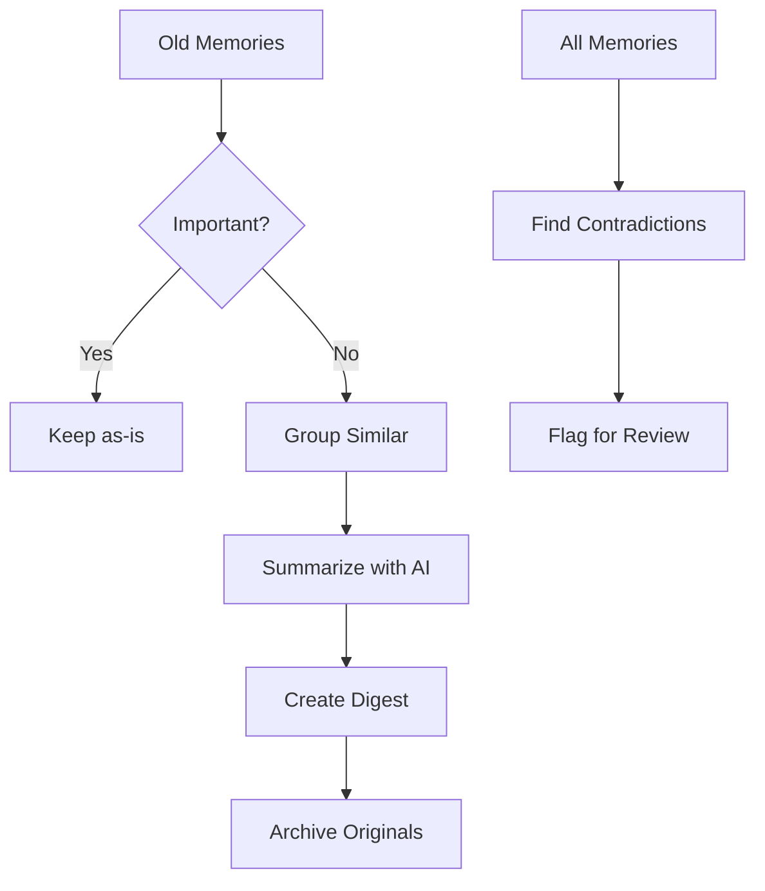

# Engram

**Give your AI a perfect memory.**

Engram remembers everything you tell it—names, relationships, preferences, conversations—and recalls exactly what's relevant when you need it. Memories naturally fade over time unless they're important or frequently accessed, just like real memory.

Works with any LLM that supports MCP (Model Context Protocol)—Claude, GPT, Gemini, local models, and more.

> *An engram is a unit of cognitive information imprinted in a physical substance—the biological basis of memory.*

---

## What It Does

Tell your AI about your world:

> "My colleague Sarah is allergic to shellfish and prefers window seats. She's leading the Q1 product launch."

Later, ask:

> "I'm booking a team lunch and flights for the offsite—what should I know?"

Engram connects the dots—*avoid seafood restaurants, book Sarah a window seat, and she's probably busy with the launch*—and gives your AI the context to truly help.

**It's not just search. It's understanding.**

---

## Quick Start

### Install

```bash
npm install -g @199-bio/engram
```

### Add to Your MCP Client

**Claude Desktop** — add to `~/Library/Application Support/Claude/claude_desktop_config.json`:

```json
{
  "mcpServers": {
    "engram": {
      "command": "npx",
      "args": ["-y", "@199-bio/engram"],
      "env": {
        "ANTHROPIC_API_KEY": "sk-ant-..."
      }
    }
  }
}
```

**Claude Code:**

```bash
claude mcp add engram -- npx -y @199-bio/engram
```

**Other MCP clients** — point to the `engram` command. It speaks standard MCP over stdio.

That's it. Your AI now has memory.

---

## How Memory Works

Engram models memory like your brain does—important things stick, unimportant things fade, and everything connects.



### Three Key Ideas

**1. Memories Fade Over Time**

Just like real memory, things you haven't thought about recently become harder to recall. But important or emotional memories resist fading.

```
Fresh memory (today)      → Easy to recall
Old but important memory  → Still accessible
Old, trivial memory       → Fades away
```

**2. Accessing Memories Strengthens Them**

Every time a memory is recalled, it becomes stronger and lasts longer. Frequently accessed memories become permanent.

**3. Everything Connects**

People, places, and things form a web of relationships. When you ask about Sarah, Engram also knows she works at Acme Corp and is leading the Q1 launch.

---

## The Memory Lifecycle



### Consolidation (Optional)

With an API key, Engram can periodically compress old memories into summaries—like how sleep consolidates your memories. This keeps important information while reducing storage.

```bash
# Run consolidation manually
consolidate  # Compresses old memories, finds contradictions
```

---

## What Makes It Special

| Feature | Why It Matters |
|---------|----------------|
| **Hybrid Search** | Finds memories by keywords AND meaning |
| **Knowledge Graph** | Understands relationships between people, places, things |
| **Natural Forgetting** | Old, unimportant memories fade; important ones persist |
| **Strengthening** | Frequently recalled memories become permanent |
| **Consolidation** | Compresses old memories, detects contradictions |
| **Fast** | ~50ms to recall, feels instant |

---

## How to Use

Just talk naturally. Your AI will remember what matters.

### Storing Memories

Say things like:
- "Remember that Sarah is allergic to shellfish"
- "My anniversary is March 15th"
- "I prefer morning meetings, never schedule anything before 9am"

The AI automatically extracts:
- **Importance**: Key facts get higher priority
- **Entities**: People, places, organizations mentioned
- **Relationships**: How entities connect to each other

### Recalling

Just ask:
- "What do you know about Sarah?"
- "When is my anniversary?"
- "What are my meeting preferences?"

Results are ranked by:
- **Relevance**: How well it matches your question
- **Recency**: Recent memories surface first
- **Importance**: High-priority info stays accessible

### The Knowledge Graph

Engram doesn't just store text—it understands relationships:

- **People**: Sarah, John, Dr. Martinez
- **Places**: Office, Conference Room A, Seattle HQ
- **Organizations**: Acme Corp, Stanford, FDA
- **Connections**: Sarah → works at → Acme Corp
- **Observations**: Sarah is allergic to shellfish

This means when you ask about Sarah's work, Engram knows to also surface relevant information about Acme Corp.

---

## The Tools

Your AI gets these capabilities:

| Tool | What It Does |
|------|--------------|
| `remember` | Store something new (with importance, emotions, timing) |
| `recall` | Find relevant memories (ranked by relevance + recency) |
| `forget` | Remove a memory |
| `create_entity` | Add a person, place, or concept |
| `observe` | Note something about an entity |
| `relate` | Connect two entities |
| `query_entity` | Get everything about someone/something |
| `list_entities` | See all people, places, etc. |
| `stats` | Check memory statistics |
| `consolidate` | Compress old memories, find contradictions |
| `engram_web` | Launch visual memory browser |

---

## Examples

### Personal Assistant

```
You: "Remember that my anniversary is March 15th and my partner loves Italian food"
AI: ✓ Stored. I've noted this as an important date with preferences.

You: "I need to plan something special next month"
AI: Your anniversary is coming up on March 15th! Given your partner's love for
    Italian food, perhaps a nice Italian restaurant reservation?
```

### Relationship Context

```
You: "My friend David lives in Austin and always recommends great coffee shops."
AI: ✓ Stored. Created entity: David (person), with observation about Austin and coffee expertise.

You: "I'm visiting Austin next week"
AI: David is in Austin—he'd probably have great coffee shop recommendations!
    Want me to remind you to ask him?
```

### Professional Memory

```
You: "John Chen is our VP of Engineering. He prefers async communication and hates meetings before 11am."
Claude: ✓ Stored. Created entity: John Chen (person, VP of Engineering).

You: "I need to schedule a sync with John"
Claude: Given John's preferences, I'd suggest a late morning slot, maybe 11:30am,
        or an async Loom video if it doesn't require real-time discussion.
```

---

## Privacy

**Your memories stay on your machine.**

- All data stored locally in `~/.engram/`
- No external APIs required for core functionality
- Consolidation uses Anthropic API (optional, requires key)
- You own your data completely

---

## Technical Details

<details>
<summary>How Search Works</summary>

Engram uses a three-layer retrieval system:

1. **BM25 (Keyword Search)**: SQLite FTS5 finds exact matches—names, dates, specific phrases
2. **Semantic Search**: Neural embeddings find conceptually related memories
3. **Knowledge Graph**: Entity relationships expand context

These are fused using Reciprocal Rank Fusion (RRF), then adjusted for:
- **Retention**: How fresh is this memory?
- **Salience**: How important/emotional is it?



</details>

<details>
<summary>How Forgetting Works</summary>

Memories follow an exponential decay curve (inspired by the Ebbinghaus forgetting curve):

```
Retention = e^(-time / stability)
```

Where:
- **time**: Days since last access
- **stability**: Memory strength (increases each time you recall it)

High-importance and high-emotion memories decay slower. Frequently accessed memories become essentially permanent.

</details>

<details>
<summary>How Consolidation Works</summary>



Consolidation:
1. Groups related low-importance memories
2. Creates AI-generated summaries (digests)
3. Detects contradictory information
4. Archives original memories

Requires `ANTHROPIC_API_KEY` environment variable.

</details>

<details>
<summary>Architecture</summary>

```
engram/
├── src/
│   ├── index.ts              # MCP server entry
│   ├── storage/
│   │   └── database.ts       # SQLite + FTS5 + temporal fields
│   ├── graph/
│   │   └── knowledge-graph.ts
│   ├── retrieval/
│   │   ├── colbert.ts        # Semantic search
│   │   └── hybrid.ts         # RRF + decay + salience
│   ├── consolidation/
│   │   └── consolidator.ts   # Memory compression
│   └── web/
│       └── server.ts         # Visual browser
```

</details>

<details>
<summary>Building from Source</summary>

```bash
git clone https://github.com/199-biotechnologies/engram.git
cd engram
npm install
npm run build

# Install globally from local build
npm install -g .
```

**Python Dependencies** (for semantic search):
```bash
pip install ragatouille torch
```

If Python isn't available, Engram falls back to a simpler retriever automatically.

</details>

<details>
<summary>Configuration</summary>

Environment variables:
- `ENGRAM_DB_PATH`: Database location (default: `~/.engram/`)
- `ANTHROPIC_API_KEY`: Required for consolidation features

Claude Desktop full config:
```json
{
  "mcpServers": {
    "engram": {
      "command": "engram",
      "env": {
        "ENGRAM_DB_PATH": "/custom/path/",
        "ANTHROPIC_API_KEY": "sk-ant-..."
      }
    }
  }
}
```

</details>

<details>
<summary>Performance</summary>

On M1 MacBook Air:
- **remember**: ~100ms
- **recall**: ~50ms (includes decay calculation)
- **graph queries**: ~5ms
- **consolidate**: ~2-5s per batch (API call)

Database size: ~1KB per memory (text + embeddings + graph data)

</details>

---

## Roadmap

- [x] Core MCP server
- [x] Hybrid search (BM25 + Semantic)
- [x] Knowledge graph
- [x] Entity extraction
- [x] Temporal memory decay
- [x] Memory consolidation
- [x] Web dashboard
- [ ] Export/import
- [ ] Scheduled consolidation

---

## Author

**Boris Djordjevic**
Founder, [199 Biotechnologies](https://199bio.com)

## License

MIT — use it however you want.

---

<p align="center">
  <i>Built with care by <a href="https://github.com/199-biotechnologies">199 Biotechnologies</a></i>
</p>
